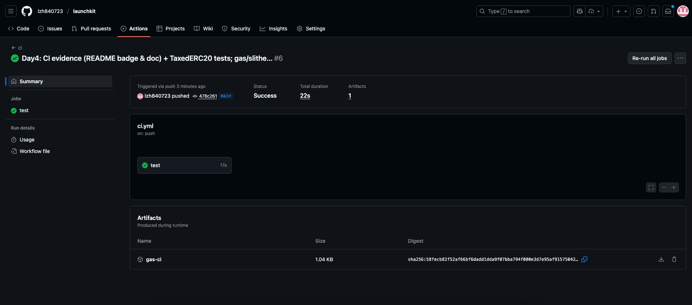

# Evidence Pack #1 — Foundry CI Green (verifiable)

**Problem**  
No automated test pipeline or gas baseline; reviewers can’t quickly verify engineering quality.

**Actions**  
- Integrated GitHub Actions: `forge test -vvv` + `forge test --gas-report`.  
- Uploaded `gas-ci.txt` as an artifact; added a CI badge and viewing instructions in README.

**Results**  
- Actions run: ✅ green (see screenshot below)  
- Artifact: `gas-ci.txt` (downloadable)  
- Key config: `defaults.run.working-directory: evm` (tests confined to subfolder)

**Screenshot**  

**Links**  
- Repo: <paste repository URL>  
- Run: <paste the “ci” run URL>  
- Gas artifact: in the run page → **Artifacts → gas-ci** (`gas-ci.txt`)

**Next**  
- Show gas in Job Summary (no download needed).  
- Add coverage artifact and Slither job (see Day5–Day9 plan).

---

## Screenshots
- CI run — green with artifact  
  

- CI run — alt view  
  
