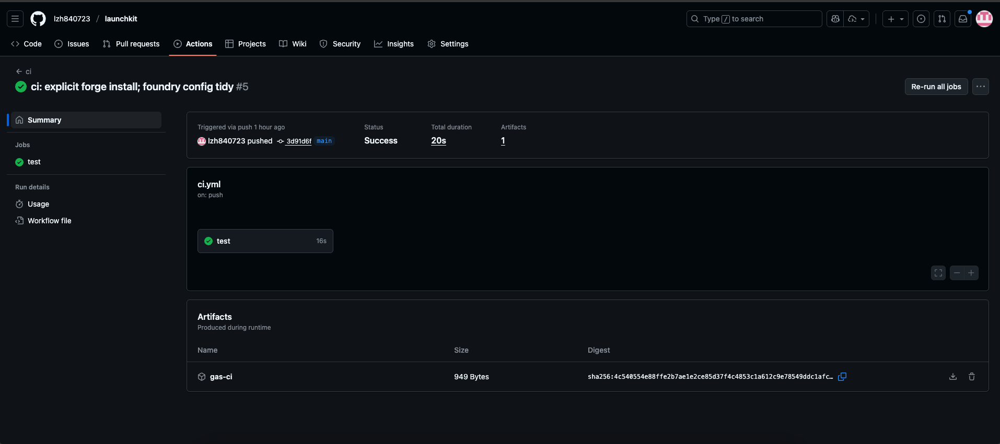
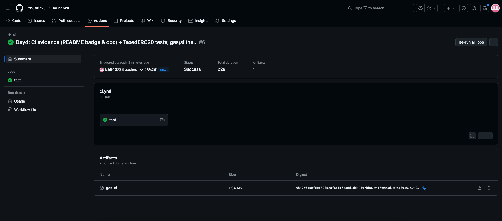

# Evidence Pack #1 — Foundry CI Green (verifiable)

**Problem**  
No automated test pipeline or gas baseline; reviewers can’t quickly verify engineering quality.

**Actions**  
- Integrated GitHub Actions: `forge test -vvv` + `forge test --gas-report`.  
- Uploaded `gas-ci.txt` as an artifact; added a CI badge and viewing instructions in README.
- Scoped workflow to `evm/` via `defaults.run.working-directory: evm`.

**Results**  
- Actions run: ✅ green  
- Artifact: `gas-ci.txt` (downloadable)  
- Tests are confined to the `evm/` subfolder (monorepo-safe).

**Links (click to verify)**  
- Repo: https://github.com/<you>/launchkit  
- Run (permalink): https://github.com/<you>/launchkit/actions/runs/<id>  
- Gas artifact: in the run page → **Artifacts → gas-ci** (`gas-ci.txt`)

**Next**  
- Add coverage artifact and a Slither job (Day5–Day9 plan).

---

## Screenshots
- CI run — green with artifact  
  

- CI run — alternate view  
  

---

<details>
<summary><strong>Gas Report (Job Summary excerpt)</strong></summary>

```text
No files changed, compilation skipped

Ran 2 tests for test/Factory.t.sol:FactoryTest
[PASS] test_CreateToken_MintsToOwner() (gas: 1545984)
[PASS] test_OnlyOwnerCanCreate() (gas: 36532)
Suite result: ok. 2 passed; 0 failed; 0 skipped; finished in 1.67ms (1.31ms CPU time)

Ran 8 tests for test/TaxedERC20.t.sol:TaxedERC20Test
[PASS] test_SetTaxBps_And_Event() (gas: 49112)
[PASS] test_SetTaxBps_RevertOverCap() (gas: 37683)
[PASS] test_SetTaxCollector_And_Event() (gas: 51441)
[PASS] test_TaxDistribution() (gas: 1893604)
[PASS] test_pause() (gas: 70935)
[PASS] test_taxedTransfer() (gas: 114678)
[PASS] test_taxedTransferFrom() (gas: 158068)
[PASS] test_whitelistNoTax() (gas: 138730)
Suite result: ok. 8 passed; 0 failed; 0 skipped; finished in 3.72ms (8.55ms CPU time)

╭----------------------------------------------+-----------------+-------+--------+-------+---------╮
| contracts/TaxedERC20.sol:TaxedERC20 Contract |                 |       |        |       |         |
...
| transferFrom                                 | 86662           | 86662 | 86662  | 86662 | 1       |
╰----------------------------------------------+-----------------+-------+--------+-------+---------╯

╭--------------------------------------------------+-----------------+--------+--------+---------+---------╮
| contracts/TokenFactory.sol:TokenFactory Contract |                 |        |        |         |         |
...
| createToken                                      | 25812           | 772845 | 772845 | 1519879 | 2       |
╰--------------------------------------------------+-----------------+--------+--------+---------+---------╯

Ran 2 test suites in 5.59ms (5.39ms CPU time): 10 tests passed, 0 failed, 0 skipped (10 total tests)

</details>```