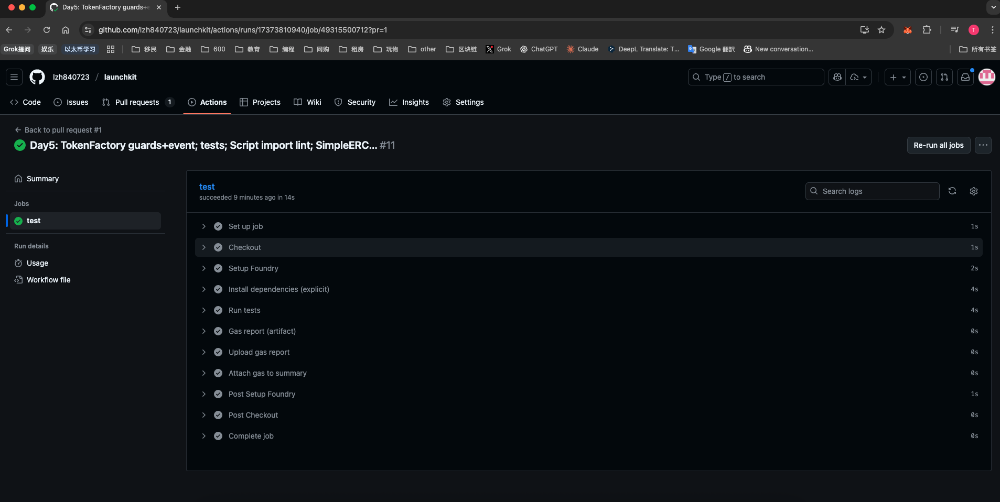

# Evidence Pack #1 — Foundry CI Green (verifiable)

**Repo**: https://github.com/<你的账号>/launchkit  
**Branch/Commit**: feat/day5-tokenfactory / <commit hash>

## What we changed (Day5)
- TokenFactory: input guards + custom errors + TokenCreated event
- Tests: success path + event assertion + 3 failing cases
- Scripts: alias import for Script.sol; minimal CreateOneToken
- SimpleERC20: decimals configurable (for Day5 usage)

## How to reproduce
1) Clone + `forge test -vvv`
2) See Actions → latest “ci” → Summary（附截图）
3) Download artifact **gas-ci** → `gas-ci.txt`（附原件）

## Screenshots

## Artifacts
- Attached: `gas-ci.txt` (full gas report from CI)
